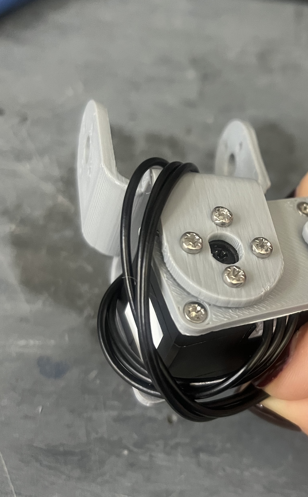
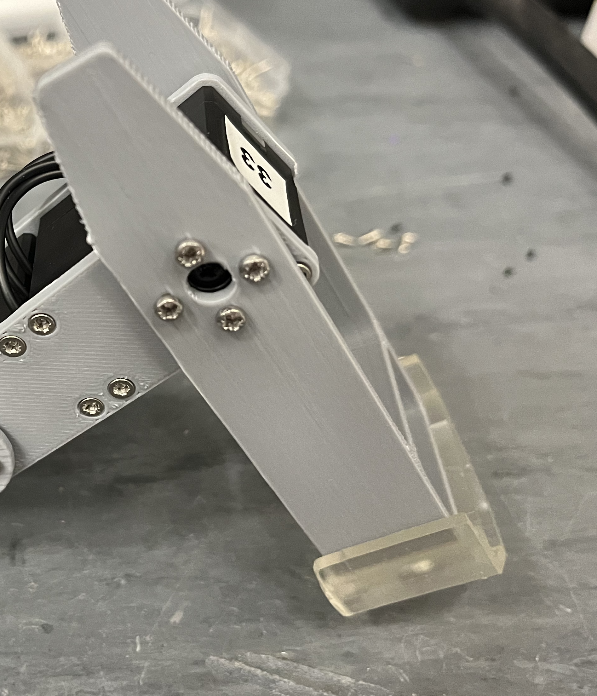
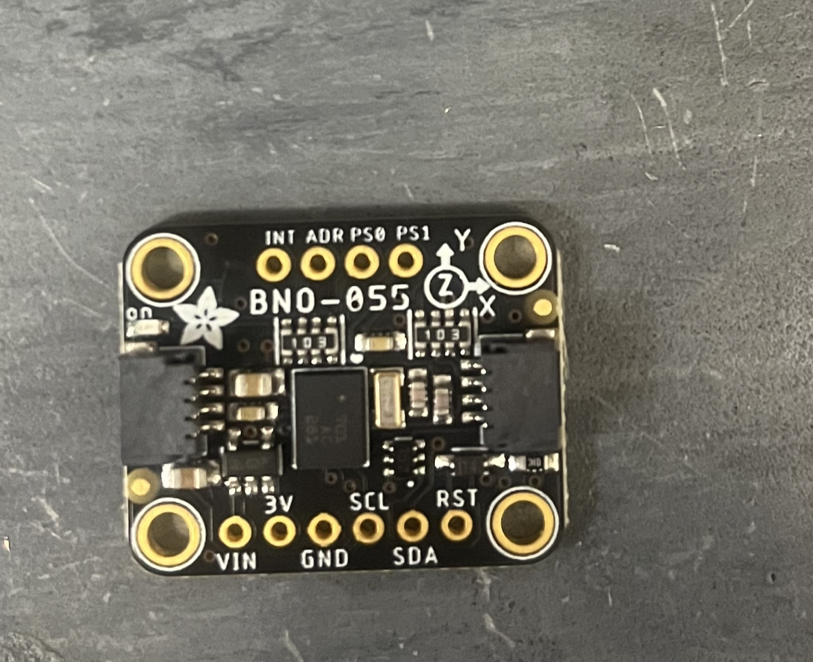

# QuTee building manual
> Before you start building the QuTee, ensure that you have printed all the parts listed in the **Print list**, as well as all materials. 

>You also want to make sure you have flashed your 12 motors (3 per leg). Each leg should have IDs *n*1, *n*2 and *n*3, where *n* is the leg number. Labelling the motors will help you remember which are which.

---

### Part 1: Assembling the legs

**Step 1.1: Motors and side**
Start with the 8 *side* pieces and screw 1 per leg on the motors ending with 2 and 3, leaving the side with connectors exposed.

Make a custom cable long enough to connect the 2 motors for each leg.

Make another wire long enough to handle the maximum rotation of the joint connected to motor 2. 
 

You can now close this part of the leg with the second *side* piece. Repeat this for all 4 legs. They should look like this:

**Step 1.2: Adding doubleU and tibias**

Screw the *double U* to the side with motor 2 and the *tibia* to that with motor 3. 

The horns and spaces should be screwed on the side of the motor without a mobile circular part. 

Make sure that the mobile part of the motor has the double dash facing inward and single dash facing outward (zero position of the motors).

Your 4 legs should now look like this:

> **Note**: there is a gap in the *double U* for passing through the long wire.

**Step 1.3: Feet**
Push on the feet to the end of each tibia.

---
### Part 2: Assembling body parts

**Step 2.1: IMU**
Screw the IMU to the *body bottom* part. 

> Ensure that the X and Y arrows are pointing the same way on the body and IMU.
> 
> 
> 

**Step 2.2: Micro-controller**
Using a soldering iron, solder 4 wires to the GND, A0, A1 and VBAT pins on the *micro-controller*. 

>As shown above, you can slide the *spacer* part onto the *power board*, which will later hold the *micro-controller*. However, we recommend waiting until you have connected the 4 legs for this part.

---
### Part 3: Connecting legs to the body

**Step 3.1: **
Screw the motors ending with 1 on the *body base*.

>Ensure that the position of each leg motor matches the numbers printed on the *body bottom* and that the little extra rectangle aligns along *body base* and *body bottom*.

**Step 3.2: Connect motors to power board**

To connect the 4 legs to the *power board*, you need to make 2 "Y" cables.

Ensure the cables are long enough to connect to the motors ending in 1 screwed to the *body base*. 2 legs at a time are conected to the 3-pin ports on the *power board*. The larger holes on the *body base* are used to pass the wires through.

With the four legs connected, as well as the *micro-controller*, the *power board* should look like this:

**Step 3.3**
Connect the *battery* and *battery connector*. This goes in between the *body bottom* and *body base*. 

**Step 3.4**
Connect the *IMU cable* from the IMU to the underside of the *micro-controller*. 

**Step 3.5**
Screw the *power board* to the top of *body base*.

**Step 3.5**
Screw on the *body bottom* to the motors, over the side with spacers. 

**Step 3.6**
Screw on the 4 legs over their corresponding body motors.

---
### Part 4: Final look

You are done! Your QuTee should look like this. 

 
